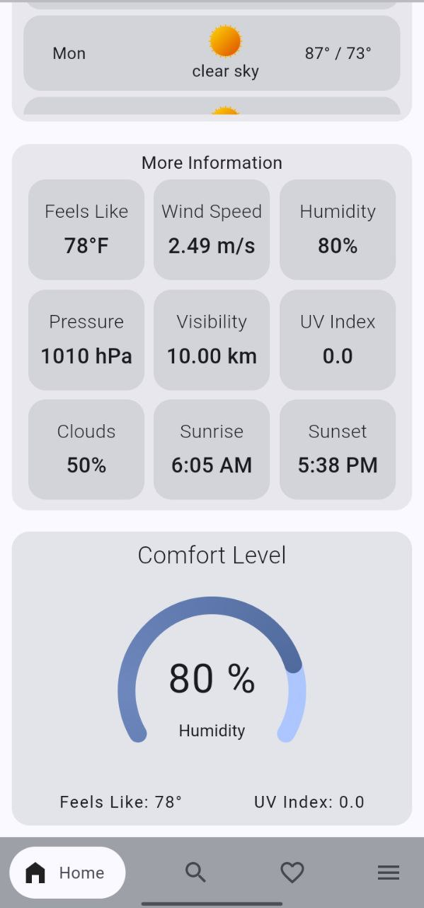
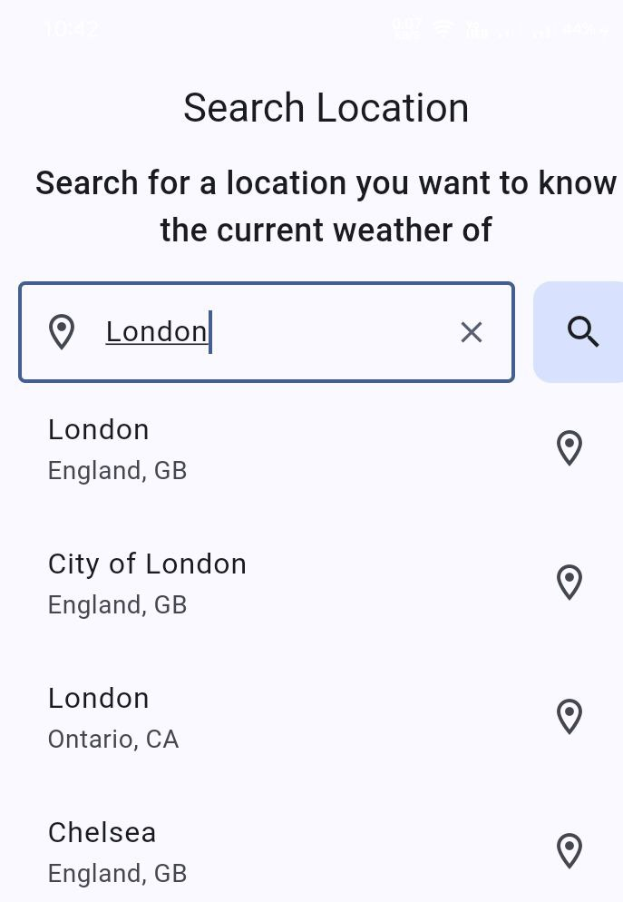
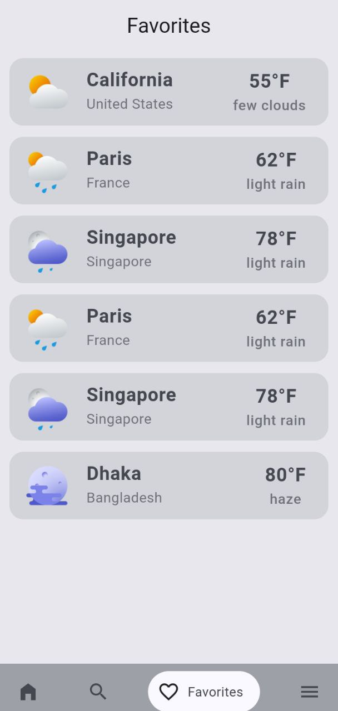
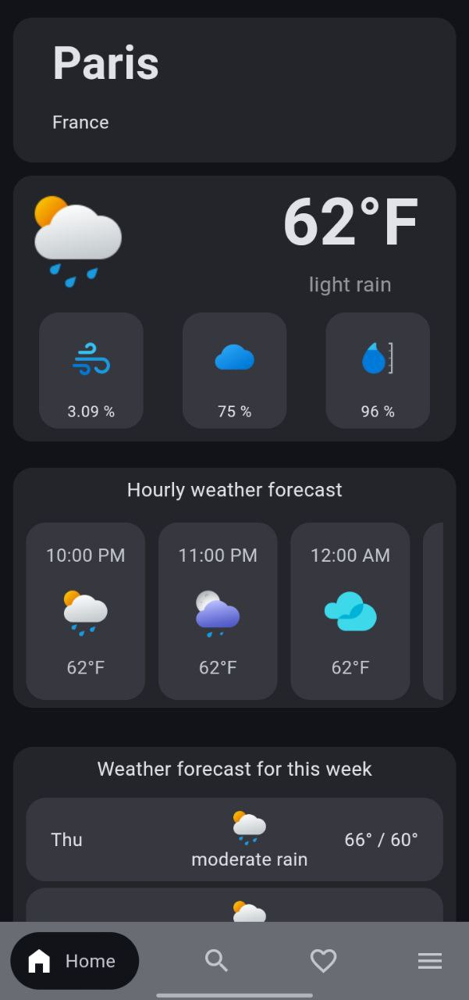
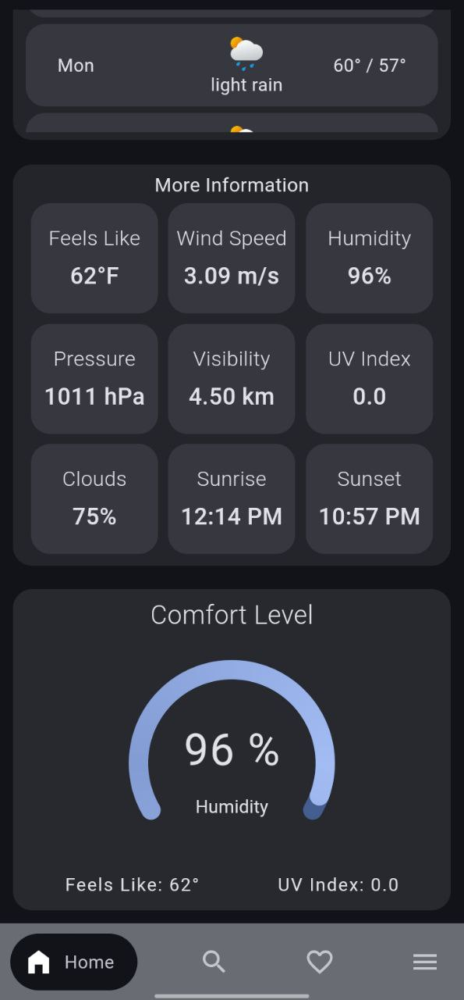

# Weather Mate ☁️🌦️

Welcome to **Weather Mate**, your reliable and intuitive weather companion for accurate, up-to-date weather information. Whether you're planning your day or preparing for unexpected changes, Weather Mate ensures you have the most current weather details right at your fingertips.

## Features 🌟

- **Accurate Weather Data**: Get real-time weather updates, including temperature, humidity, wind speed, and more.
- **Location-Based Forecasts**: Automatically receive weather updates for your current location, or search for forecasts in other cities worldwide.
- **Favorites List**: Save favorite locations to easily track weather in places that matter most to you.
- **Customizable Preferences**: Toggle between Celsius and Fahrenheit for temperature readings and choose between light or dark themes for a personalized user experience.
- **Offline Fallback**: Even without an internet connection, previously loaded weather data for your current location is available.

## Screenshots 📸

- **Light Mode** 
   
   
   
   
   

- **Dark Mode**  
   
   
   
  
  


## Technologies Used 🛠️

- **Flutter**: A powerful framework for building cross-platform mobile applications.
- **Riverpod**: State management solution for efficient and scalable data handling.
- **Hive**: Lightweight key-value database for local data storage.
- **Lottie**: Delightful animations used throughout the app for a smooth and engaging user experience.
- **OpenWeatherMap API**: Provides precise and reliable weather data globally.

## Getting Started 🚀

### Option 1: Install the APK

To install Weather Mate on your Android device:

1. Go to the [Releases](https://github.com/MotiurRahmanSany/weather-mate/releases) page.
2. Download the latest APK file (`weather_mate_v1.0.0.apk`).
3. Transfer the APK file to your Android device.
4. Install the APK by opening the file. You may need to enable installation from unknown sources in your device settings.

### Option 2: Build from Source

To run Weather Mate from the source code:

1. Clone this repository:
    ```bash
    git clone https://github.com/MotiurRahmanSany/weather-mate.git
    ```
2. Install dependencies:
    ```bash
    flutter pub get
    ```
3. Run the app:
    ```bash
    flutter run
    ```

## How It Works ⚙️

- **Weather Updates**: Weather Mate fetches weather data from OpenWeatherMap's API and updates in real-time.
- **Favorites List**: Manage and view favorite locations for easy access to weather updates.
- **Offline Mode**: If the app detects a lack of internet connection, it provides previously loaded weather data to keep users informed.

## Developer 👨‍💻

Weather Mate was proudly developed by **[Motiur Rahman](https://www.linkedin.com/in/motiur-rahman-sany-405506272/)**. If you like this project, consider giving a star 🌟 to the repository and supporting the developer!
